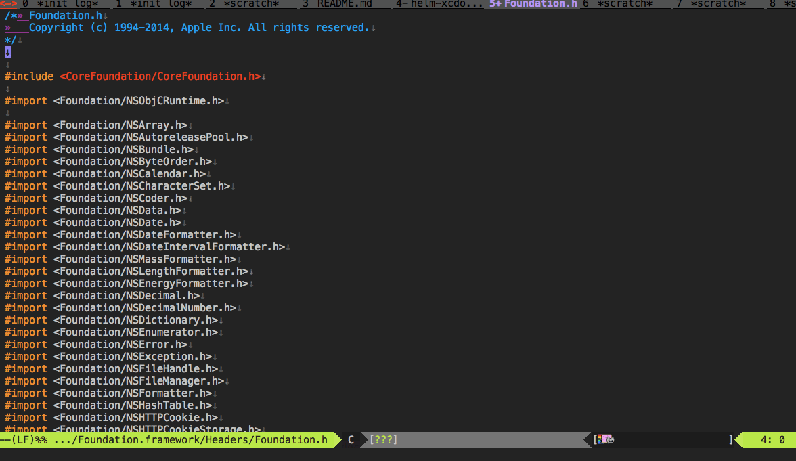

# helm-xcdoc.el

## Introduction

`helm-xcdoc.el` will be able to view on a eww by searching in the Xcode Document at helm interface


## Screenshot




## Requirements

* Emacs 24.4 or higher
* helm 1.5 or higher


## Basic Usage

#### `helm-xcdoc-search`

to search document

#### `helm-xcdoc-search-other-window`

to search document with other-window


## Customize

#### `helm-xcdoc-command-path`(Default: `nil`)

command path of `docsletutil'.

#### `helm-xcdoc-command-option`(Default: `nil`)

Command line option of `docsetutil'.

#### `helm-xcdoc-document-path`(Default: `nil`)

path of docset.

#### `helm-xcdoc-maximum-candidates`(Default: `'100`)

Maximum number of helm candidates

## Sample Configuration

```lisp
(setq helm-xcdoc-command-path "/Applications/Xcode.app/Contents/Developer/usr/bin/docsetutil")
(setq helm-xcdoc-document-path "~/Library/Developer/Shared/Documentation/DocSets/com.apple.adc.documentation.AppleiOS8.1.iOSLibrary.docset")
```
